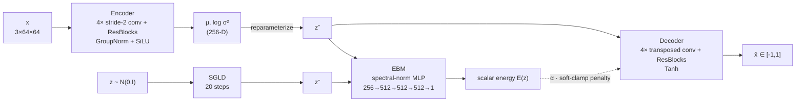

# Joint Training of Latent-Space Energy-Based Models and β-VAEs for Anime Face Generation

**Arad Vazirpanah**, **Mohammad Hossein Aref** — Universität Hamburg, Dept. Informatik (Knowledge Technology)
Supervised by **Josua Spisak**

📄 [Paper](Paper/Energy_Based_Models.pdf) · 🖥️ [Slides](Paper/EBM_Presentation.pdf) · 💻 [Code](EBM-VAE_Vazirpanah_Aref/)

---

## Overview

A hybrid generative model that trains a **β-VAE** and an **energy-based model (EBM)** *jointly*, with the EBM living in the VAE's 256-dimensional latent space rather than in pixel space.

The motivating tension: VAEs give you a structured, smooth latent space but blurry samples. EBMs are flexible and multi-modal but carry an intractable normalizing constant and require slow MCMC sampling. This work combines them so each covers the other's weakness.

**The core contribution is *bidirectional coupling*.** Prior latent-EBM work is sequential — train the VAE, freeze it, then fit an EBM on top as a post-hoc prior. Here the two are trained together and influence each other:

- The **EBM shapes the VAE posterior** during training, via an energy penalty added to the VAE loss.
- The **VAE provides the EBM** with a compact, structured manifold where MCMC actually mixes.

Because the EBM operates on 256-D latent codes instead of 3×64×64 pixels, Langevin sampling costs 20 gradient steps through a small MLP rather than 20 passes through a full image network.

### How this differs from prior work

| Method | EBM space | Training | MCMC target | VAE coupling |
|---|---|---|---|---|
| Pang et al. (2020) | Latent | Sequential | Prior $p(z)$ | Inference only |
| VAEBM (Xiao et al., 2021) | Pixel | Sequential | Data $p(x)$ | None |
| Nie et al. (2021) | Latent | Sequential | Latent (ODE) | None |
| **Ours** | **Latent** | **Joint** | **Posterior $q_\phi(z\mid x)$** | **Bidirectional** |

---

## Key results

Trained on ~15,000 Anime Face images at 64×64, for 30 epochs of VAE pretraining + 30 epochs of joint training.

| Metric | Start | End | Reading |
|---|---|---|---|
| **Energy gap** $E^+ - E^-$ | +0.44 | **−54.25** | EBM learned to separate real latents from SGLD samples |
| Reconstruction loss (train) | 708.1 | 691.1 | No degradation from the energy penalty |
| KL divergence (train) | 150.9 | 141.5 | **No posterior collapse** |
| SGLD drift | — | 8.67 (range 8.27–9.64) | Langevin chains move consistently; stable gradients |

Train and validation curves stay nearly identical throughout — the model generalizes rather than memorizes. Latent interpolations between real faces produce smooth transitions in hair color, face shape, and other attributes, indicating a well-structured manifold.

> **Caveat, stated plainly by the authors:** there is **no FID evaluation**, which makes head-to-head comparison against prior work difficult. Results are reported as energy dynamics + qualitative samples.

---

## Method

### Architecture



| Component | Shape flow | Parameters |
|---|---|---|
| **Encoder** | `3×64×64` → 64 → 128 → 256 → 512 ch, spatial 64→32→16→8→4 → flatten → `μ`, `log σ²` ∈ ℝ²⁵⁶ | 13,223,872 |
| **Decoder** | ℝ²⁵⁶ → 4×4×512 → 256 → 128 → 64 → `3×64×64`, Tanh output | 11,132,995 |
| **EBM** | ℝ²⁵⁶ → 512 → 512 → 512 → 1 (LayerNorm + SiLU, plus a linear skip 256→1) | 660,737 |
| | **Total** | **25,017,604** |

Design choices that matter:

- **Spectral normalization** on every EBM layer bounds the Lipschitz constant, keeping the energy landscape smooth enough for SGLD to navigate and preventing energy collapse.
- **No BatchNorm** in the EBM — batch statistics would be contaminated by fantasy particles.
- **GroupNorm + SiLU** throughout the VAE for stability; pre-activation ResBlocks at every spatial scale.
- The EBM is deliberately **lightweight (~2.6% of total parameters)** — its job is discriminative scoring, not generation.

<sub>The paper quotes the EBM at 262K parameters; instantiating `EBM(latent_dim=256, hidden_dim=512, num_layers=4)` from `config.py` defaults actually yields 660,737. The **2.6% share of the total is correct either way**, so this looks like a transcription slip rather than a different model.</sub>

### Training: two phases, two alternating steps

**Phase 1 — VAE pretraining** (30 epochs). Standard β-VAE with β linearly annealed 0 → 1 over the first 15 epochs, giving a well-formed latent space before the EBM is introduced.

**Phase 2 — Joint training** (30 epochs). Each iteration alternates:

**Step A — VAE update (EBM frozen).** Gradients flow only into the encoder/decoder:

$$\mathcal{L}_\text{VAE} = \mathcal{L}_\text{MSE} + \beta \cdot D_\text{KL}\big(q_\phi(z|x) \,\|\, p(z)\big) + \alpha \cdot \mathrm{sc}\big(E_\psi(z^+)\big)$$

where the **soft clamp** $\mathrm{sc}(x) = 10 \cdot \tanh(x/10)$ behaves like the identity near zero and saturates smoothly at ±10. Unlike a hard clamp, its gradient is *never* exactly zero — so the energy signal never silently dies.

**Step B — EBM update (VAE frozen, $z^+$ detached).** Contrastive divergence:

$$\mathcal{L}_\text{CD} = E_\psi(z^+) - E_\psi(z^-) + \lambda\big(E_\psi(z^+)^2 + E_\psi(z^-)^2\big)$$

with $\lambda = 10^{-4}$ as an anchor preventing energy divergence. Minimizing this pushes energy **down** on encoded real data and **up** on SGLD samples.

Note a deliberate asymmetry in the code: Step A uses a **reparameterized sample** as $z^+$, while Step B uses the **deterministic posterior mean** $\mu$ (detached).

**Schedules.** β is held at 1.0 when warm-starting from a pretrained VAE. α ramps linearly 0 → `alpha_max` over the first third of joint training, decoupling EBM learning from VAE optimization early on.

### Negative sampling: short-run SGLD

Negative samples $z^-$ come from Stochastic Gradient Langevin Dynamics:

$$z_{t+1} = z_t - \tfrac{\eta}{2}\nabla_z E_\psi(z_t) + \epsilon_t, \qquad \epsilon_t \sim \mathcal{N}(0, \sigma^2 I)$$

run for **T = 20 steps** with η = 0.5, σ = 0.1, and per-sample gradient clipping at 5.0.

Chains **always restart from fresh $\mathcal{N}(0, I)$ noise** (`short_run=True`). `SGLDSampler` also implements a persistent replay buffer, but it is unused by default: when the VAE posterior is already close to $\mathcal{N}(0,I)$, the buffer tends to collapse onto data modes. Short-run sampling sidesteps that failure mode entirely, at the cost of being computationally wasteful — a limitation the authors acknowledge.

---

## Repository structure

```
VAE-EBM/
├── EBM-VAE_Vazirpanah_Aref/
│   ├── config.py          # All hyperparameters (single dataclass)
│   ├── dataset.py         # AnimeFaceDataset + train/val DataLoaders
│   ├── train_vae.py       # Phase 1: β-VAE pretraining
│   ├── train_joint.py     # Phase 2: joint VAE + EBM training
│   └── models/
│       ├── vae.py         # Encoder, Decoder, VAE (ELBO, sampling, reconstruction)
│       ├── ebm.py         # Spectral-norm MLP energy function
│       └── sgld.py        # SGLD sampler (short-run + replay-buffer modes)
└── Paper/
    ├── Energy_Based_Models.pdf   # 8-page paper
    └── EBM_Presentation.pdf      # 15-slide deck
```

---

## Setup

### 1. Install dependencies

There is no `requirements.txt`. You need:

```bash
pip install torch torchvision pillow matplotlib
```

Device selection is automatic (`config.py`): **MPS → CUDA → CPU**, in that order.

### 2. Get the dataset

Download the [Anime Face Dataset](https://www.kaggle.com/datasets/splcher/animefacedataset) from Kaggle and unzip so the layout is:

```
EBM-VAE_Vazirpanah_Aref/
└── data/
    └── animefacedataset/
        └── images/
            ├── 000001.jpg
            └── ...
```

`config.subset_size = 15_000` randomly samples 15k images (seed 42); 10% is held out for validation.

## Usage

All commands run from inside `EBM-VAE_Vazirpanah_Aref/`.

### Phase 1 — Pretrain the β-VAE

```bash
python train_vae.py
```

Writes to `outputs/checkpoints/vae_best.pt`, plus periodic samples and reconstructions.

### Phase 2 — Joint VAE + EBM training

```bash
python train_joint.py \
    --vae_ckpt outputs/checkpoints/vae_best.pt \
    --alpha_max 1.0 \
    --epochs 30
```

Warm-starting drops the VAE learning rate to `1e-5` and pins β at 1.0, so the pretrained latent space isn't disrupted while the EBM comes online.

### Other modes

```bash
# Train both from scratch (no warm start; β ramps, VAE lr = 1e-4)
python train_joint.py

# Resume a full joint run (VAE + EBM together)
python train_joint.py --joint_ckpt outputs/checkpoints/joint_best.pt
```

`--vae_ckpt` and `--joint_ckpt` are mutually exclusive.

### Outputs

```
outputs/
├── checkpoints/
│   ├── vae_best.pt                    # Phase 1
│   ├── joint_best.pt                  # Phase 2 (best val reconstruction)
│   └── joint_epoch_XXX.pt             # every save_interval epochs
├── samples/
│   ├── joint_ebm_epoch_XXX.png        # decoded from 20-step SGLD latents
│   ├── joint_gaussian_epoch_XXX.png   # decoded from z ~ N(0,I)  [baseline]
│   └── joint_recon_epoch_XXX.png      # reconstructions
└── metrics/
    ├── joint_metrics.csv
    └── joint_training.png
```

The `joint_ebm_*` vs `joint_gaussian_*` pairing is the money shot: same decoder, same epoch, latents drawn from the learned EBM prior versus the plain Gaussian prior.

---

## Configuration

Everything lives in the `Config` dataclass in `config.py`.

| Group | Parameter | Default | Notes |
|---|---|---|---|
| **Data** | `image_size` | 64 | Center-cropped, normalized to [−1, 1] |
| | `subset_size` | 15,000 | Random subset (seed 42) |
| | `val_split` | 0.1 | |
| | `num_workers` | 0 | Raise this to speed up data loading |
| **Model** | `latent_dim` | 256 | Shared by VAE and EBM |
| | `base_channels` | 64 | Doubles per downsample: 64→128→256→512 |
| **VAE** | `lr_vae` | 1e-4 | AdamW, cosine annealing, weight decay 1e-4 |
| | `num_epochs_vae` | 30 | |
| | `beta_start` → `beta_end` | 0.0 → 1.0 | Linear over `beta_warmup_epochs` = 15 |
| | `batch_size` | 64 | |
| **EBM** | `ebm_hidden_dim` | 512 | |
| | `ebm_num_layers` | 4 | |
| | `lr_ebm` | 1e-4 | Adam, StepLR (×0.5 every 20 epochs) |
| | `num_epochs_ebm_vae` | 30 | |
| **SGLD** | `mcmc_steps` | 20 | Short-run chains |
| | `mcmc_step_size` | 0.5 | η — large, to compensate for few steps |
| | `mcmc_noise` | 0.1 | σ |
| | `mcmc_grad_clip` | 5.0 | Per-sample gradient norm |
| | `mcmc_reinit_prob` | 1.0 | Always restart from N(0,I) |
| | `mcmc_buffer_size` | 10,000 | **Unused** — `short_run=True` is hardcoded |

α is *not* in the config — it's the `--alpha_max` CLI flag on `train_joint.py` (default 1.0).

---

## Reading the training logs

`train_joint.py` prints its own watch-list on startup, and it's worth taking seriously:

```
  α·E   — should be non-zero throughout (soft_clamp gives gradient always)
  gap   — trends negative, should SLOW DOWN after epoch 20 (not grow forever)
  recon — stays near warm-start level or improves
  kl    — stable (no posterior collapse)
```

Some interpretation:

- **`gap` = E⁺ − E⁻.** Going negative means the EBM has learned to assign low energy to real encoded faces and high energy to its own SGLD samples. That's the training signal working.
- **But an *unboundedly* growing gap is not a pure win.** It means the sampler isn't catching up with the energy function — the EBM is winning the contrastive game by running away rather than by modeling the distribution. This is why the code's own guidance says the gap should *decelerate*. Watch the second derivative, not just the sign.
- **`drift`** measures how far SGLD chains travel from their N(0,I) start in 20 steps. Consistent drift means the energy gradient is meaningfully steering the chains; drift collapsing toward zero would mean the EBM has flattened out.
- **`kl` flatlining near zero** would indicate posterior collapse. It doesn't happen here (150.9 → 141.5).

---

## Known issues and gotchas

Beyond the two missing modules above:

1. **`vae_best.pt` is not actually the best checkpoint.** In `train_vae.py`, the best-val-loss tracking is commented out (lines ~123, ~151–164) and `torch.save(...)` runs unconditionally every epoch — so the file holds the **last** epoch, not the best one. Uncomment the guard if you want true best-checkpointing. (`joint_best.pt` in `train_joint.py` *is* properly gated on validation reconstruction.)
2. **The replay buffer is dead code.** `SGLDSampler` supports persistent chains, but `train_joint.py` hardcodes `short_run=True`. The `mcmc_buffer_size` and `mcmc_reinit_prob` settings have no effect as shipped.
3. **`num_workers = 0`** by default — data loading is single-threaded and will bottleneck on most machines.
4. **`generate.py` does not exist**, despite being suggested in `train_joint.py`'s final message. Sampling code has to be written from `VAE.decode` + `SGLDSampler.sample`.
5. **No `requirements.txt`**, no pinned versions, no seeds beyond the dataset split.

---

## Limitations & future work

Taken from the paper's own discussion:

- **No FID.** Without it, quantitative comparison against VAEBM or Pang et al. isn't possible. Adding FID against a plain-VAE baseline is the single highest-value next step.
- **Hyperparameter sensitivity.** α, β, and the SGLD step size were tuned manually for this setting; the procedure is not robust to changing them.
- **Fresh-start SGLD is wasteful.** Persistent MCMC chains (à la Du & Mordatch) would reuse computation — at the risk of the buffer collapse that short-run sampling was chosen to avoid.
- **Resolution.** 64×64 only; scaling up would likely need a hierarchical latent space.

---

## Citation

```bibtex
@misc{vazirpanah2025jointebmvae,
  title  = {Joint Training of Latent-Space Energy-Based Models and
            {$\beta$}-{VAE}s for Anime Face Generation},
  author = {Vazirpanah, Arad and Aref, Mohammad Hossein},
  note   = {Universität Hamburg, Dept. Informatik (Knowledge Technology).
            Supervised by Josua Spisak},
  url    = {https://github.com/aradvazir/VAE-EBM},
  year   = {2025}
}
```

## References

1. LeCun et al. *A Tutorial on Energy-Based Learning.* Predicting Structured Data, 2006.
2. Kingma & Welling. *Auto-Encoding Variational Bayes.* ICLR 2014.
3. Goodfellow et al. *Generative Adversarial Nets.* NeurIPS 2014.
4. Du & Mordatch. *Implicit Generation and Modeling with Energy Based Models.* NeurIPS 2019.
5. Grathwohl et al. *Your Classifier is Secretly an Energy Based Model and You Should Treat it Like One.* ICLR 2020.
6. Pang et al. *Learning Latent Space Energy-Based Prior Model.* NeurIPS 2020.
7. Xiao et al. *VAEBM: A Symbiosis between Variational Autoencoders and Energy-Based Models.* ICLR 2021.
8. Nie et al. *Controllable and Compositional Generation with Latent-Space Energy-Based Models.* NeurIPS 2021.
9. Higgins et al. *β-VAE: Learning Basic Visual Concepts with a Constrained Variational Framework.* ICLR 2017.
10. Welling & Teh. *Bayesian Learning via Stochastic Gradient Langevin Dynamics.* ICML 2011.
11. splcher. [*Anime Face Dataset.*](https://www.kaggle.com/datasets/splcher/animefacedataset) Kaggle, 2021.

## Acknowledgments

Thanks to **Josua Spisak** for supervision and guidance throughout this project.
